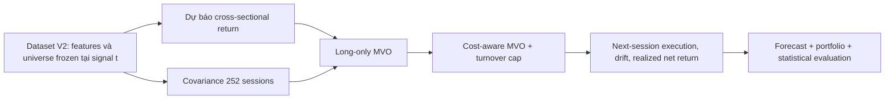

# Blueprint triển khai thực nghiệm: Transformer dự báo lợi suất và tối ưu danh mục có chi phí

## 1. Mục tiêu và phạm vi triển khai

Mục tiêu là kiểm tra chuỗi nhân quả gồm ba lớp tách biệt:



Thiết kế chính là **two-stage**: model chỉ dự báo expected return; covariance, optimizer và chi phí nằm ngoài neural network. Điều này bám phương pháp luận trong `deep-research-report.md` và cho phép ablation riêng cho forecast, optimization và cost awareness.

### Trạng thái freeze và giới hạn claim

`Dataset Freeze V2 — Experimental Dataset` là dataset chính thức cho toàn bộ thí nghiệm hiện tại, không chỉ là smoke test. Target chính thức là `raw_return_5d`; 35,680 labels có giá entry/exit chính xác. Có thể chạy đầy đủ baseline, Transformer, MVO và backtest ngay.

| Protocol | Trạng thái | Claim được phép | Claim không được phép |
|---|---|---|---|
| `v2_experimental_protocol` | **FROZEN / ACTIVE** | Relative forecast và portfolio performance giữa các model/optimizer trong cùng experimental panel. | Excess return; universe point-in-time/survivorship-free; total return đã được xác minh độc lập; hiệu quả có thể đạt được trên toàn thị trường Việt Nam. |
| `v3_enhanced_protocol` | Optional future enhancement | Có thể nâng claim theo từng hạng mục đã được bổ sung và audit. | Không tự động kế thừa claim chưa có bằng chứng. |

Không được đổi target, universe policy, cost rule hay split sau khi xem kết quả test. Nếu bổ sung RF sau này, phải tạo một protocol/version kết quả mới thay vì sửa ngầm V2.

## 2. Data contract hiện tại

Nguồn dữ liệu là Dataset V2. Mỗi weekly signal date tạo một cross-section 100 cổ phiếu được **freeze bằng dữ liệu không muộn hơn close `t`**.

| File | Khóa | Vai trò |
|---|---|---|
| `data/processed/features.parquet` | `signal_date`, `symbol`, `sequence_step` | 60×18 tensor input, `sequence_step=0..59` theo thứ tự cũ → mới. |
| `data/processed/targets.parquet` | `signal_date`, `symbol` | Entry/exit, `raw_return_5d` và target mask. Đây là target chính thức của V2. |
| `data/processed/universe_weekly.parquet` | `signal_date`, `symbol` | Universe frozen, liquidity proxy, exchange, session IDs. |
| `data/processed/market_calendar.parquet` | `session_id` | Master trading-session calendar. |
| `data/raw/ohlcv/*.parquet` | `symbol`, `time` | Chỉ dùng để dựng 252-session covariance và realized backtest path. |

### Timing contract bắt buộc

| Sự kiện | Thời điểm |
|---|---|
| Signal/features/covariance cutoff | close `t` |
| Định nghĩa Top-100 | close `t`, past-only liquidity/history/features |
| Dự báo và optimizer | sau close `t` |
| Thực thi | close `t+1` |
| Holding exit/label | close `t+6` |

Mọi data loader và backtester phải giữ contract này. Cấm dùng `target_available`, entry price hay exit price để thay đổi constituent Top-100.

### Masks và missing-price policy

`targets.parquet` có `exact_price_target_available` và `target_status`.

- **Training/forecast metric:** dùng loss mask `exact_price_target_available=True`; không thay thế ticker khác.
- **Missing entry close:** trade không khả dụng; portfolio giữ pre-trade position/cash theo policy backtest.
- **Missing exit close:** không tạo synthetic label. Trong backtest, đánh dấu-to-last-observed-price và tiếp tục giữ vị thế cho tới close hợp lệ kế tiếp; phải log sự kiện này.
- **Outside cached calendar:** giữ trong frozen universe và loại khỏi metric/decision period tương ứng, không backfill.

Số liệu V2 hiện tại để assert trong test:

| Đại lượng | Giá trị |
|---|---:|
| Frozen forecast dates | 359 |
| Frozen stock-week rows | 35,900 |
| Exact raw-return labels | 35,680 |
| Missing target rows | 220 |
| Feature rows | 2,154,000 = 35,900 × 60 |
| Features | 18 |

## 3. Splits và protocol walk-forward

| Split | Signal dates | Exact labels | Vai trò |
|---|---:|---:|---|
| Train: 2019–2022 | 201 | 20,084 | Fit scaler, model weights, target winsorization thresholds. |
| Validation: 2023 | 50 | 5,000 | Model selection, hyperparameters, risk aversion, turnover cap. |
| Test: 2024–2025 | 102 | 10,196 | One final out-of-sample evaluation. |
| Excluded boundary/warm-up | 6 | 400 | Không dùng để tune hay report main result. |

### Staged implementation

1. **Pilot fixed-split:** train chỉ trên train, chọn toàn bộ configuration bằng validation, đánh giá test một lần. Đây là milestone code đầu tiên.
2. **Main expanding walk-forward:** sau khi protocol bị khóa, retrain theo quý trong test bằng các labels đã thực sự xảy ra trước forecast origin. Không dùng future test labels.
3. **Robustness:** rolling/expanding windows, chỉ chạy sau main result; không chọn winner từ robustness.

Không random-shuffle forecast dates. Mini-batch có thể gồm nhiều `signal_date`, nhưng mỗi sample vẫn là một full cross-section `(N=100, L=60, F=18)`.

## 4. Feature processing

### Feature list v2

`return_1d`, `return_5d`, `return_20d`, `return_60d`, `intraday_range`, `open_to_close_return`, `volatility_5d`, `volatility_20d`, `volatility_60d`, `close_to_sma_5/20/60`, `volume_to_ma_5/20/60`, `log_volume`, `log_liquidity_proxy`, `amihud_20`.

### Normalization

1. Fit robust feature scaler **chỉ trên training sequence rows**: median và IQR per feature.
2. Clip transformed features theo training bounds, ví dụ `[-10, 10]` sau robust scaling.
3. Persist `scaler.json` cùng run. Validation/test chỉ gọi `transform`.
4. Không normalize target bằng statistics của validation/test. Nếu scale target để training ổn định, fit scale trên available train labels và inverse-transform forecast trước optimizer.
5. Có thể thêm cross-sectional z-score như ablation sau; statistics phải chỉ dùng 100 constituents frozen tại chính signal `t`.

### Feature extension V3 (không trộn vào pilot)

Sau khi baseline chạy ổn định, thêm market return/volatility, relative-to-market return, cross-sectional dispersion và calendar flags. Mọi biến VNINDEX/macro phải có ngày hiệu lực rõ. Fundamentals, sector và stock-ID embeddings chỉ là extensions vì thiếu mapping point-in-time hiện tại.

## 5. Forecast models

### Contract chung

```text
input:   X[B, 100, 60, 18]
mask:    M[B, 100]                 # exact target available
output:  mu_hat[B, 100]            # predicted 5-session raw return
label:   y[B, 100]
loss:    Huber(mu_hat[M], y[M])
```

Primary selection metric: validation mean weekly Spearman rank IC. Guardrail: validation MAE/Huber không suy giảm nghiêm trọng so với best simple baseline.

### PTCST đề xuất

1. Patch mỗi chuỗi 60 ngày thành 12 patches, length/stride `5/5`.
2. Linear patch projection `5 × 18 → d_model=64`, positional embedding theo patch.
3. Shared temporal Transformer encoder: 2 layers, 4 heads, FFN width 128, dropout 0.10.
4. Dùng final temporal embedding của 100 assets làm token cross-sectional.
5. One cross-sectional self-attention layer, 4 heads, residual + layer norm.
6. Shared MLP head `64 → 32 → 1` dự báo return từng asset.

Không dùng learned ticker-ID embedding trong main result; universe hiện có survivorship limitation và ticker ID dễ làm model ghi nhớ công ty. Exchange embedding chỉ là optional ablation.

### Baseline ladder

Triển khai và test theo thứ tự; không bắt đầu PTCST trước khi tầng trước chạy được.

| Stage | Models | Mục đích |
|---|---|---|
| S0 | Zero / historical-mean forecast | Sanity check label và metrics. |
| S1 | Ridge pooled | Strong linear baseline; sequence flatten 60×18. |
| S2 | XGBoost | Strong nonlinear tabular baseline; features ở step cuối + aggregate sequence stats. |
| S3 | LSTM hoặc TCN | Kiểm tra giá trị sequence modeling. |
| S4 | Vanilla temporal Transformer | Tách giá trị patch/cross-sectional design. |
| S5 | PatchTST-style temporal-only | Baseline modern Transformer. |
| S6 | PTCST | Mô hình đề xuất. |

Pilot tối thiểu cần S0, S1, S2, S4 và S6. Chỉ thêm LSTM/TCN/PatchTST khi pipeline, optimizer và backtest đã deterministic.

### Initial training configuration

```yaml
seed: [7, 19, 43, 71, 101]
lookback: 60
patch_length: 5
patch_stride: 5
d_model: 64
temporal_layers: 2
cross_sectional_layers: 1
n_heads: 4
ffn_dim: 128
dropout: 0.10
optimizer: AdamW
learning_rate: 3.0e-4
weight_decay: 1.0e-4
batch_forecast_dates: 16
loss: Huber(delta=1.0)
max_epochs: 100
early_stopping_patience: 10
gradient_clip_norm: 1.0
selection_metric: validation_mean_spearman_ic
```

Tuning chỉ diễn ra trên 2023 với một search space và budget được khai báo trước. Report mean/std của ít nhất năm seeds; không chọn best seed.

## 6. Risk engine và optimizer

### Covariance

Tại mỗi signal `t`, load daily `return_1d`/raw close return của đúng 100 frozen constituents qua **252 master sessions kết thúc ở `t`**. Missing return không được impute qua suspension.

Main risk estimator: `sklearn.covariance.LedoitWolf`. Robustness sau: sample covariance và EWMA half-life 60.

Nếu covariance window không đủ/ill-conditioned, log event và thực hiện fallback cố định đã định trước: Ledoit–Wolf trên complete available assets; assets không đủ history được giữ pre-trade và không được thay ex-post.

### Cost-aware long-only MVO

Cho forecast `mu_hat`, covariance `Sigma`, pre-trade weights `w_pre`:

\[
\max_w\;w^\top\widehat\mu-\frac{\lambda}{2}w^\top\widehat\Sigma w
- c\sum_i|w_i-w_i^-|.
\]

Main constraints:

```text
sum(w) = 1
0 <= w_i <= 0.05
L1 turnover = sum(abs(w - w_pre)) <= 0.40
no leverage; cash = 0 in main specification
```

Main assumed proportional cost: `c = 10 bps` trên total absolute traded value. Evaluate **mọi** strategy net of cùng cost; `cost-unaware` chỉ nghĩa optimizer không có penalty. Sensitivity sau: 0, 5, 10, 20, 30, 50 bps.

Use CVXPY with deterministic solver preference `CLARABEL` then `OSQP`; save solver status/objective. A solver failure must trigger pre-specified fallback `w = w_pre`, not silently equal-weight.

### Drift-aware rebalance and realized return

1. Có target weights ở signal `t`.
2. Đến close `t+1`, derive pre-trade weights từ old weights đã drift theo realized prices.
3. Solve/rebalance; subtract cost from portfolio value at `t+1`.
4. Giữ tới close `t+6`; compute gross/net return.
5. Drift target weights theo realized asset returns để tạo `w_pre` cho rebalance kế tiếp.

Persist từng decision date: forecast, target weight, pre-trade weight, executed weight, trade, cost, solver status, realized return và all missing-price events.

## 7. Backtest strategies và ablations

| ID | Forecast | Optimizer | Cost penalty in decision |
|---|---|---|---|
| EW | None | Equal weight weekly | No |
| EW-BH | None | Equal weight buy-and-hold | No |
| MinVar | None | Ledoit–Wolf minimum variance | No |
| HM-MVO | Historical mean | MVO | No |
| XGB-MVO | XGBoost | MVO | No |
| PTCST-TopK | PTCST | Equal-weight top predicted k | No |
| PTCST-MVO | PTCST | MVO | No |
| XGB-CA-MVO | XGBoost | Cost-aware MVO | Yes |
| PTCST-CA-MVO | PTCST | Cost-aware MVO | Yes |

Trong evaluation, tất cả strategies bị trừ realized assumed cost. Core ablations trả lời:

- PTCST vs Ridge/XGBoost: forecast value.
- PTCST-MVO vs PTCST-TopK: optimizer value.
- PTCST-CA-MVO vs PTCST-MVO: cost-awareness value.
- PTCST-CA-MVO vs XGB-CA-MVO/EW/MinVar: complexity có đáng giá hay không.

## 8. Metrics, inference và outputs

### Forecast

Theo từng forecast date (không coi 100 assets cùng ngày là independent): Spearman rank IC, Pearson IC, MAE, Huber, directional accuracy, top-minus-bottom spread. Report mean, std và ICIR theo time series tuần.

### Portfolio

Primary: annualized net Sharpe, net certainty-equivalent return, L1/one-way turnover. Secondary: gross/net annualized return, volatility, max drawdown, Sortino, Calmar, CVaR, cost drag, HHI, max weight, active holdings.

Với `v2_experimental_protocol`, tính Sharpe từ weekly raw net returns và ghi rõ đây không phải excess-return Sharpe. Khi RF available, tạo `v3_enhanced_protocol`, chạy lại toàn bộ evaluation liên quan và báo cáo riêng; không thay thế kết quả V2 sau khi đã xem test.

### Statistical tests

- DM/HLN trên forecast-date-level loss differential.
- Paired stationary/block bootstrap (block 4–12 weeks) cho IC, Sharpe, CE, net return và turnover gaps.
- Chỉ sau full protocol: factor alpha/regime analysis và SPA/Reality Check nếu nhiều variants.

Mọi run phải lưu parquet/CSV: `forecasts`, `weights`, `trades`, `portfolio_returns`, `metrics_by_date`, `config`, `seed`, `git_commit`, `data_report_hash`.

## 9. File architecture để bắt đầu code

```text
configs/
  v2_experimental_protocol.yaml       # frozen raw-return experiment
  v3_enhanced_protocol.yaml           # optional; enabled only with separately versioned data
src/
  data/
    v2_dataset.py                     # date-batched tensor loader + masks
    transforms.py                     # fit/transform training-only scaler
    covariance.py                     # 252-session Ledoit-Wolf engine
  models/
    baselines.py                      # zero, historical mean, Ridge, XGBoost
    temporal.py                       # LSTM/TCN/vanilla temporal Transformer
    ptcst.py                          # proposed architecture
  portfolio/
    optimizer.py                      # frictionless + cost-aware CVXPY MVO
    backtest.py                       # execution, drift, costs, missing-price policy
  evaluation/
    forecast_metrics.py
    portfolio_metrics.py
    bootstrap.py
  utils/
    io.py
    reproducibility.py
scripts/
  validate_v2_contract.py
  run_forecast_baselines.py
  run_backtest.py
  run_experiment.py
tests/
  test_dataset_contract.py
  test_no_leakage.py
  test_optimizer_constraints.py
  test_backtest_accounting.py
runs/<run_id>/
  config.yaml
  forecasts.parquet
  weights.parquet
  trades.parquet
  metrics.json
```

## 10. Dependency-ordered implementation plan

| Order | Deliverable | Definition of done |
|---:|---|---|
| 0 | `validate_v2_contract.py` | Asserts 100 assets/date, 60 timesteps, masks/status consistency, chronological splits, no duplicate keys. |
| 1 | Data loader + scaler | Returns `(X, y, mask, metadata)` per forecast-date batch; scaler fit only on train. |
| 2 | Forecast metrics + S0/S1 | Zero/historical-mean and Ridge produce train/val/test forecasts and date-level metrics. |
| 3 | Risk engine | Covariance at `t` uses exactly past 252 sessions and reports conditioning/failures. |
| 4 | Optimizer unit tests | Long-only, sum-to-one, 5% cap, 40% turnover cap, deterministic fallback. |
| 5 | Backtest kernel | Next-close execution, drift, same cost accounting for every strategy; artifacts persisted. |
| 6 | XGBoost MVO + EW/MinVar | End-to-end non-deep benchmark table exists before deep models. |
| 7 | PTCST | Five-seed train/validation loop, early stopping by validation rank IC. |
| 8 | PTCST MVO and CA-MVO | Main ablations and gross/net comparison. |
| 9 | Robustness and inference | Pre-specified cost/covariance/lookback grid, bootstrap and reporting. |

## 11. Mandatory tests against leakage

1. Alter every target/entry/exit value after a signal date and assert that its frozen `universe_weekly` membership is unchanged.
2. Assert all feature timestamps `<= signal_date`.
3. Assert every covariance return timestamp `<= signal_date`.
4. Assert model scaler parameters are invariant when validation/test rows are altered.
5. Assert all target-missing assets remain in universe and are not replaced by rank 101.
6. Assert trade timestamp is `execution_date`, never `signal_date`.
7. Assert optimizer output satisfies constraints within tolerance and failed solves use logged fallback.
8. Recompute one portfolio week independently from stored weights/trades/prices/costs.

## V3 dataset freeze addendum — active protocol

`v3_enhanced_protocol` is now **FROZEN / ACTIVE** for the Vietnam-only main study. The frozen artifact set is defined by `data/lseg_v3/reports/freeze_manifest_v3.json`; it must not be overwritten. Any later download, cleaning change, universe change, risk-free revision, or cost-rule change requires a new dataset version and a separate experiment run.

Permitted claim: results describe relative forecasting and portfolio performance within a Vietnam HOSE/HNX historical monthly-universe panel, using LSEG adjusted daily data, a VND 1-month cash proxy, and an assumed transaction-cost sensitivity.

Prohibited claim: do not describe this dataset or its results as survivorship-bias-free, a complete point-in-time investable universe, a complete listing/delisting history, fully corporate-action-verified, or based on observed historical bid/ask costs. Historical monthly membership and the corporate-action ledger reduce specific risks but do not remove these limitations.

## 12. Claim policy, limitations và enhancement sau freeze

V2 là một **experimental dataset freeze** hợp lệ. Trong abstract, methodology, results và conclusion phải dùng nhất quán wording sau:

> We construct a historical daily-price panel for securities contained in the HOSE/HNX reference universe available at the data-collection date, and forecast five-session forward returns derived from the retrieved historical price series.

Và limitation bắt buộc:

> Securities delisted before the reference snapshot may be absent. Results are conditional on this retained current-reference universe and are not interpreted as survivorship-bias-free estimates of realizable market-wide investment performance.

Do đó, V2 chỉ được kết luận về **relative predictive and portfolio performance within the experimental dataset**. Không dùng các cụm “excess return”, “survivorship-bias-free”, “point-in-time investable universe”, hoặc “fully verified total return”.

### Workstreams hậu freeze (không chặn experiment V2)

| Workstream | Artifact cần bổ sung | Khi hoàn thành |
|---|---|---|
| RF | `data/external/risk_free_daily.parquet` với `date`, `rf_daily`, source, `published_at`, yield convention. | Tạo `excess_return_5d`; chạy thành protocol/version mới. |
| Historical universe | Point-in-time security master và listing/delisting/transfer ledger. | Giảm survivorship bias và cập nhật claim theo coverage được audit. |
| Corporate actions | Event ledger, snapshot-revision audit và validation 286 flags. | Có bằng chứng tốt hơn cho cách diễn giải adjusted-price/total-return. |

Mỗi enhancement phải có data dictionary, extract timestamp, checksums, git commit và report coverage. Không được ghi đè artifacts V2 hay thay đổi V2 test result.
